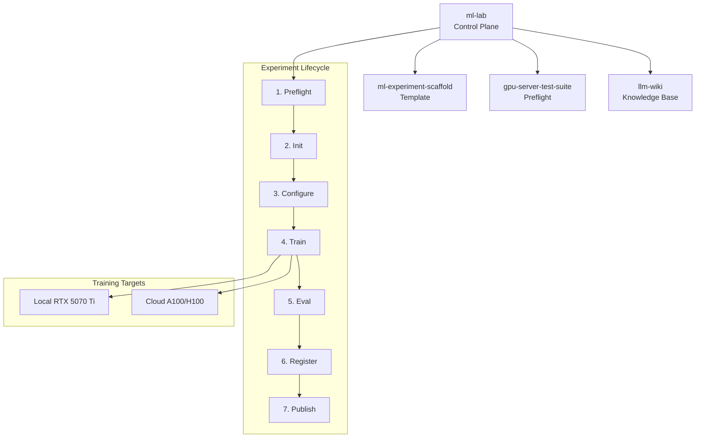

<div align="center">

<h1>ml-lab</h1>

<p>ML research control plane — experiment lifecycle, model registry, cloud training launcher</p>


</div>

> Demo coming soon

## Why

Running ML experiments across local hardware and cloud GPUs produces scattered checkpoints, siloed W&B projects, and no systematic way to compare results. ml-lab connects existing tools (ml-experiment-scaffold, gpu-server-test-suite, llm-wiki) into a unified 7-stage lifecycle: preflight → init → configure → train → eval → register → publish. Same configs work locally on an RTX 5070 Ti and on cloud A100s.

## Features

- **Experiment initialization** from ml-experiment-scaffold templates
- **GPU preflight checks** via gpu-server-test-suite before training
- **Config validation** catches impossible hyperparameter combos (fp8 training, OOM configs)
- **Cloud training** with rsync + SSH to RunPod, Lambda, or vast.ai
- **Model registry** — append-only JSONL with eval scores, config hashes, metadata
- **Cross-experiment leaderboard** for comparing models across methods and seeds
- **Automated W&B sync** for Device Guard environments via WSL
- **Knowledge integration** — publish findings to llm-wiki

## Architecture



## Quick Start

```bash
# Clone
git clone https://github.com/t-timms/ml-lab.git
cd ml-lab

# Install
pip install -e ".[dev]"

# Create a new experiment
make new-experiment NAME=gsm8k-grpo

# Validate config
make validate-config EXP=2026-04-gsm8k-grpo

# Run preflight + train
make train EXP=2026-04-gsm8k-grpo

# Register model after training
make register EXP=2026-04-gsm8k-grpo

# View leaderboard
make leaderboard
```

## Project Structure

```
ml-lab/
├── experiments/          # Experiment instances (from scaffold template)
│   └── YYYY-MM-<name>/  # Each experiment with configs, src, results
├── registry/
│   ├── models.jsonl      # Append-only model index
│   └── README.md         # Schema documentation
├── cloud/
│   ├── providers.yaml    # RunPod/Lambda/vast.ai configs
│   ├── launch.py         # rsync + SSH orchestrator
│   ├── Dockerfile.train  # Training container
│   └── setup_remote.sh   # One-shot remote env setup
├── scripts/
│   ├── new_experiment.py # Init from scaffold template
│   ├── preflight.py      # GPU health check
│   ├── register_model.py # Post-training registration
│   ├── cross_compare.py  # Leaderboard generator
│   ├── sync_wandb.py     # WSL-based W&B sync
│   └── research_to_wiki.py # Push findings to llm-wiki
├── src/ml_lab/
│   ├── cli.py            # Click CLI
│   └── config_validator.py # Config validation
├── tests/                # pytest test suite
├── Makefile              # Top-level orchestration
└── pyproject.toml
```

## Development

```bash
# Run tests
make test

# Lint + format
make lint

# Run specific test
pytest tests/test_config_validator.py -v
```

## License

[MIT](LICENSE)
